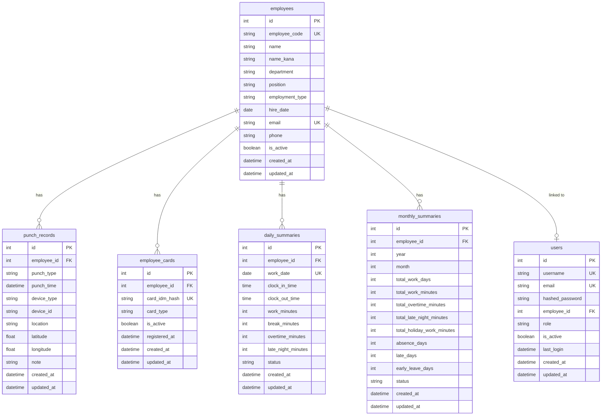

# データベーススキーマ設計書

## 概要
本ドキュメントでは、勤怠管理システムのデータベーススキーマについて説明します。

## ER図



## テーブル詳細

### 1. employees（従業員）
従業員の基本情報を管理するマスターテーブル

| カラム名 | 型 | 制約 | 説明 |
|---------|-----|------|------|
| id | INTEGER | PK, AUTO_INCREMENT | 従業員ID |
| employee_code | VARCHAR(20) | UNIQUE, NOT NULL | 従業員コード |
| name | VARCHAR(100) | NOT NULL | 氏名 |
| name_kana | VARCHAR(100) | | 氏名（カナ） |
| department | VARCHAR(100) | | 部署 |
| position | VARCHAR(100) | | 役職 |
| employment_type | VARCHAR(50) | | 雇用形態（正社員/パート/アルバイト） |
| hire_date | DATE | | 入社日 |
| email | VARCHAR(255) | UNIQUE | メールアドレス |
| phone | VARCHAR(20) | | 電話番号 |
| is_active | BOOLEAN | DEFAULT TRUE | 有効フラグ |
| created_at | DATETIME | NOT NULL | 作成日時 |
| updated_at | DATETIME | NOT NULL | 更新日時 |

### 2. employee_cards（従業員カード）
従業員のICカード情報を管理

| カラム名 | 型 | 制約 | 説明 |
|---------|-----|------|------|
| id | INTEGER | PK, AUTO_INCREMENT | カードID |
| employee_id | INTEGER | FK, NOT NULL | 従業員ID |
| card_idm_hash | VARCHAR(255) | UNIQUE, NOT NULL | カードIDmのハッシュ値 |
| card_type | VARCHAR(50) | | カード種別（Suica/PASMO等） |
| is_active | BOOLEAN | DEFAULT TRUE | 有効フラグ |
| registered_at | DATETIME | | 登録日時 |
| created_at | DATETIME | NOT NULL | 作成日時 |
| updated_at | DATETIME | NOT NULL | 更新日時 |

### 3. punch_records（打刻記録）
打刻の生データを記録

| カラム名 | 型 | 制約 | 説明 |
|---------|-----|------|------|
| id | INTEGER | PK, AUTO_INCREMENT | 打刻ID |
| employee_id | INTEGER | FK, NOT NULL, INDEX | 従業員ID |
| punch_type | VARCHAR(20) | NOT NULL | 打刻種別（in/out/outside/return） |
| punch_time | DATETIME | NOT NULL, INDEX | 打刻時刻 |
| device_type | VARCHAR(50) | | デバイス種別 |
| device_id | VARCHAR(100) | | デバイスID |
| location | VARCHAR(255) | | 打刻場所 |
| latitude | FLOAT | | 緯度 |
| longitude | FLOAT | | 経度 |
| note | TEXT | | 備考 |
| created_at | DATETIME | NOT NULL | 作成日時 |
| updated_at | DATETIME | NOT NULL | 更新日時 |

**インデックス:**
- `idx_punch_employee_time`: (employee_id, punch_time)
- `idx_punch_time`: (punch_time)

### 4. daily_summaries（日次集計）
日単位の勤怠集計データ

| カラム名 | 型 | 制約 | 説明 |
|---------|-----|------|------|
| id | INTEGER | PK, AUTO_INCREMENT | 集計ID |
| employee_id | INTEGER | FK, NOT NULL | 従業員ID |
| work_date | DATE | NOT NULL | 勤務日 |
| clock_in_time | TIME | | 出勤時刻 |
| clock_out_time | TIME | | 退勤時刻 |
| work_minutes | INTEGER | DEFAULT 0 | 労働時間（分） |
| break_minutes | INTEGER | DEFAULT 0 | 休憩時間（分） |
| overtime_minutes | INTEGER | DEFAULT 0 | 残業時間（分） |
| late_night_minutes | INTEGER | DEFAULT 0 | 深夜労働時間（分） |
| status | VARCHAR(50) | | ステータス（正常/遅刻/早退/欠勤） |
| created_at | DATETIME | NOT NULL | 作成日時 |
| updated_at | DATETIME | NOT NULL | 更新日時 |

**ユニーク制約:**
- `uk_employee_date`: (employee_id, work_date)

### 5. monthly_summaries（月次集計）
月単位の勤怠集計データ

| カラム名 | 型 | 制約 | 説明 |
|---------|-----|------|------|
| id | INTEGER | PK, AUTO_INCREMENT | 集計ID |
| employee_id | INTEGER | FK, NOT NULL | 従業員ID |
| year | INTEGER | NOT NULL | 年 |
| month | INTEGER | NOT NULL | 月 |
| total_work_days | INTEGER | DEFAULT 0 | 総勤務日数 |
| total_work_minutes | INTEGER | DEFAULT 0 | 総労働時間（分） |
| total_overtime_minutes | INTEGER | DEFAULT 0 | 総残業時間（分） |
| total_late_night_minutes | INTEGER | DEFAULT 0 | 総深夜労働時間（分） |
| total_holiday_work_minutes | INTEGER | DEFAULT 0 | 総休日労働時間（分） |
| absence_days | INTEGER | DEFAULT 0 | 欠勤日数 |
| late_days | INTEGER | DEFAULT 0 | 遅刻日数 |
| early_leave_days | INTEGER | DEFAULT 0 | 早退日数 |
| status | VARCHAR(50) | | ステータス |
| created_at | DATETIME | NOT NULL | 作成日時 |
| updated_at | DATETIME | NOT NULL | 更新日時 |

**ユニーク制約:**
- `uk_employee_year_month`: (employee_id, year, month)

### 6. users（ユーザー）
システムログイン用のユーザー情報

| カラム名 | 型 | 制約 | 説明 |
|---------|-----|------|------|
| id | INTEGER | PK, AUTO_INCREMENT | ユーザーID |
| username | VARCHAR(50) | UNIQUE, NOT NULL | ユーザー名 |
| email | VARCHAR(255) | UNIQUE, NOT NULL | メールアドレス |
| hashed_password | VARCHAR(255) | NOT NULL | パスワードハッシュ |
| employee_id | INTEGER | FK, UNIQUE | 従業員ID |
| role | VARCHAR(50) | NOT NULL | ロール（admin/manager/user） |
| is_active | BOOLEAN | DEFAULT TRUE | 有効フラグ |
| last_login | DATETIME | | 最終ログイン日時 |
| created_at | DATETIME | NOT NULL | 作成日時 |
| updated_at | DATETIME | NOT NULL | 更新日時 |

## Enum定義

### PunchType（打刻種別）
```python
class PunchType(str, Enum):
    IN = "in"          # 出勤
    OUT = "out"        # 退勤
    OUTSIDE = "outside"  # 外出
    RETURN = "return"   # 戻り
```

### EmploymentType（雇用形態）
```python
class EmploymentType(str, Enum):
    FULL_TIME = "full_time"    # 正社員
    PART_TIME = "part_time"    # パートタイム
    TEMPORARY = "temporary"    # アルバイト
    CONTRACT = "contract"      # 契約社員
```

### UserRole（ユーザーロール）
```python
class UserRole(str, Enum):
    ADMIN = "admin"      # 管理者
    MANAGER = "manager"  # マネージャー
    USER = "user"        # 一般ユーザー
```

## インデックス戦略

### パフォーマンス最適化のためのインデックス
1. **punch_records**
   - 従業員別の打刻検索: `(employee_id, punch_time)`
   - 日付範囲検索: `(punch_time)`
   
2. **daily_summaries**
   - 従業員・日付検索: `(employee_id, work_date)`
   
3. **monthly_summaries**
   - 従業員・年月検索: `(employee_id, year, month)`

## データ整合性

### 外部キー制約
- employee_cards.employee_id → employees.id
- punch_records.employee_id → employees.id
- daily_summaries.employee_id → employees.id
- monthly_summaries.employee_id → employees.id
- users.employee_id → employees.id

### カスケード削除
- 従業員削除時: 関連するカード情報、打刻記録、集計データも削除

### トリガー/イベント
- 打刻記録作成時: 日次集計の自動更新
- 日次集計更新時: 月次集計の自動更新

## セキュリティ考慮事項

1. **カードIDの保護**
   - IDmは必ずハッシュ化して保存
   - ハッシュアルゴリズム: SHA-256 + Salt

2. **個人情報の保護**
   - 従業員情報へのアクセス制御
   - ロールベースのアクセス管理

3. **監査ログ**
   - 重要操作の履歴記録
   - 不正アクセスの検知

## バックアップ戦略

1. **日次バックアップ**
   - 全テーブルの完全バックアップ
   - 過去30日分を保持

2. **トランザクションログ**
   - リアルタイムレプリケーション
   - ポイントインタイムリカバリ対応

## 今後の拡張予定

1. **シフト管理テーブル**
   - shifts: シフトマスター
   - shift_assignments: シフト割当

2. **休暇管理テーブル**
   - leave_types: 休暇種別
   - leave_requests: 休暇申請

3. **通知履歴テーブル**
   - notifications: 通知履歴
   - notification_settings: 通知設定